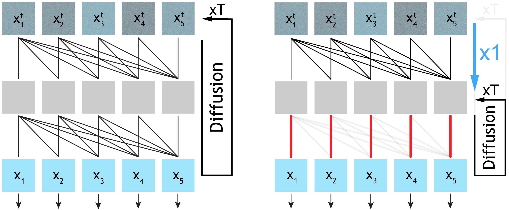

# Causality in Video Diffusers is Separable from Denoising

[[Paper](https://arxiv.org/abs/2602.10095)] [[Project Page](https://xingjianbai.com/sparse-causal-diffusion)]

<p align="center">
  
</p>

**Causality in autoregressive video diffusion models is separable from the denoising process.** Conventional causal video diffusion applies dense cross-frame attention across all layers and all denoising steps. We uncover two key patterns — early layers exhibit redundant computation across steps, and deep layers barely attend across frames — leading to **Separable Causal Diffusion (SCD)**.

**Xingjian Bai**<sup>1,2</sup>, **Guande He**<sup>3</sup>, **Zhengqi Li**<sup>2</sup>, **Eli Shechtman**<sup>2</sup>, **Xun Huang**<sup>3</sup>, **Zongze Wu**<sup>2</sup>

<sup>1</sup>Massachusetts Institute of Technology, <sup>2</sup>Adobe Research, <sup>3</sup>Morpheus AI

## TL;DR

We study how causal reasoning emerges inside autoregressive video diffusion models and find two observations:

1. **Early/middle layers are redundant across denoising steps.** These layers produce nearly identical features throughout the entire diffusion trajectory — their computation can be amortized and shared across steps without loss of information.

2. **Deep layers barely attend across frames.** Despite being trained with dense causal attention, the cross-frame attention weights in deeper layers become increasingly sparse with depth, focusing almost exclusively on intra-frame tokens.

These observations motivate **Separable Causal Diffusion (SCD)**: a causal encoder (run once per frame) handles temporal reasoning, while a lightweight denoising decoder (run T times) renders each frame independently — eliminating redundant computation and enabling faster streaming video generation.

<p align="center">
  
</p>

## Installation

```bash
# 1. Create conda environment and install dependencies
bash scripts/setup_env.sh

# 2. Download datasets and pretrained models
#    Requires a HuggingFace token: https://huggingface.co/settings/tokens
export HF_TOKEN=hf_...
bash scripts/setup_data.sh
```

## Training

```bash
# Default: 8 GPUs
./scripts/train.sh
```

<!-- ## Inference

```bash
# Evaluation with metrics (FVD, PSNR, SSIM, LPIPS)
./scripts/inference.sh path/to/ema.pth

# Generate videos
python inference/run_decoupled_16_videos.py \
    --opt options/scd_minecraft.yml \
    --checkpoint path/to/ema.pth \
    --num-videos 16
```

## Pretrained Weights

| Model | Dataset | Resolution | Download |
|-------|---------|------------|----------|
| SCD | Minecraft | 128x128 | Coming soon | -->

## Citation

```bibtex
@article{bai2025causality,
    title={Causality in Video Diffusers is Separable from Denoising},
    author={Bai, Xingjian and He, Guande and Li, Zhengqi and Shechtman, Eli and Huang, Xun and Wu, Zongze},
    journal={arXiv preprint arXiv:2602.10095},
    year={2025}
}
```

## Acknowledgments

Built on top of [FAR](https://github.com/showlab/FAR). We thank the authors for their excellent work.
